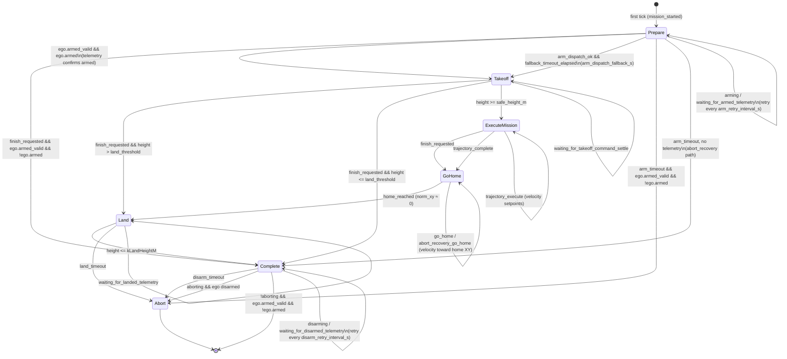

# Mission State Machine

This document describes the `TrajectoryMissionController` state machine implemented in
`src/behavior/trajectory_mission_controller.cpp`.

---

## State diagram

---

## States

| State            | Description |
|------------------|-------------|
| `Idle`           | Pre-flight; transitions immediately to `Prepare` on the first tick |
| `Prepare`        | Waits for the vehicle to arm; dispatches `Arm` command with retry |
| `Takeoff`        | Issues `Takeoff` shell command then climbs to `safe_height_m` using velocity assist |
| `ExecuteMission` | Executes the trajectory segment by segment using velocity setpoints |
| `GoHome`         | Returns to `home_pose_` XY position using velocity commands |
| `Land`           | Issues `Land` shell command and waits for `height <= kLandHeightM` |
| `Complete`       | Issues `Disarm` command and waits for ego telemetry to confirm; terminal |
| `Abort`          | Terminal error state; reached on irrecoverable timeout or hardware failure |

Terminal states: `Complete`, `Abort`.

`MissionRuntime::terminal_settled()` returns `true` once the state machine has been in
a terminal state for the configured settle period. The main frame loop uses
`terminal_settled()` (not raw state) to decide when to stop.

---

## Key config options

All are populated from the YAML `mission_options.*` key-value pairs:

| Key | Default | Description |
|-----|---------|-------------|
| `flight_safe_height_m` | 8.0 | Altitude (m) required to declare takeoff complete |
| `flight_arm_retry_interval_s` | 4.0 | Time between Arm command retries |
| `flight_arm_timeout_s` | 60.0 | Max time to wait for arming before aborting |
| `flight_arm_dispatch_fallback_s` | 0.0 | If >0, accept arm dispatch OK as a fallback after this delay |
| `flight_takeoff_velocity_mps` | 1.5 | Climb velocity (m/s) during velocity-assist phase |
| `flight_go_home_velocity_mps` | 2.0 | Horizontal speed (m/s) used in GoHome |
| `flight_land_timeout_s` | 30.0 | Max time to wait for landing before aborting |
| `flight_disarm_timeout_s` | 15.0 | Max time to wait for disarm before aborting |
| `flight_trajectory_path` | — | Path to trajectory JSON |
| `flight_home_policy` | `initial_ego_pose` | Where to fly home to |

---

## Abort recovery

An abort recovery path exists to attempt a safe landing any time the controller would
otherwise have to abort without landing.  When `begin_abort_recovery()` is called the
`aborting_` flag is set and the mission navigates `GoHome → Land → Complete → Abort`
with status messages prefixed `abort_recovery_*`.

---

## Source files

| File | Role |
|------|------|
| `src/behavior/trajectory_mission_controller.cpp` | State machine implementation |
| `include/dedalus/behavior/mission_controller.hpp` | `MissionLifecycleState` enum, `MissionTickInput/Output` contracts |
| `src/behavior/mission_runtime.cpp` | Async tick loop, `terminal_settled()` |
| `tests/unit/test_trajectory_mission_controller.cpp` | Unit tests covering state transitions |
